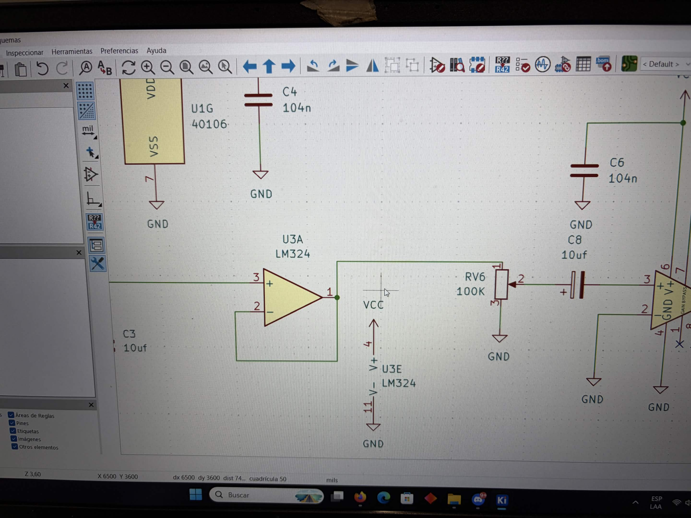

# sesion-11b

viernes 29 de mayo

## trabajo en proyecto 02

- la propuesta 1 (chip 40106 + LM324) pensabamos que el LM324 nos servia para conectar el parlante
- misa nos dijo que el LM324 es un amplificador OPERACIONAL
- que para el parlante debemos armar un módulo con un LM386, como en nuestro sintetizador anterior, ya que ese si es un amplificador de POTENCIA

parte esquemático propuesta 1

- teniendo armada la propuesta 1 tenemos problemas con el audio ya que se escucha muy bajo, o a veces muere
- corregimos el esquemático
- agregamos la fuente de alimentación en el esquemático
- asignamos algunas huellas a los componentes que ya sabiamos la huella a utilizar
- pendiente hacer pcb!

- en cuanto a la propuesta 2 estamos considerando modificarla (utilizamos un 4040 y un 4051 y un 40106) por 2 razones; una es que utiliza muchos potenciómetros (8) y algunos están fallando, y segundo es que el circuito es muy amplio al tener 3 chips y también está siendo un problema :c

