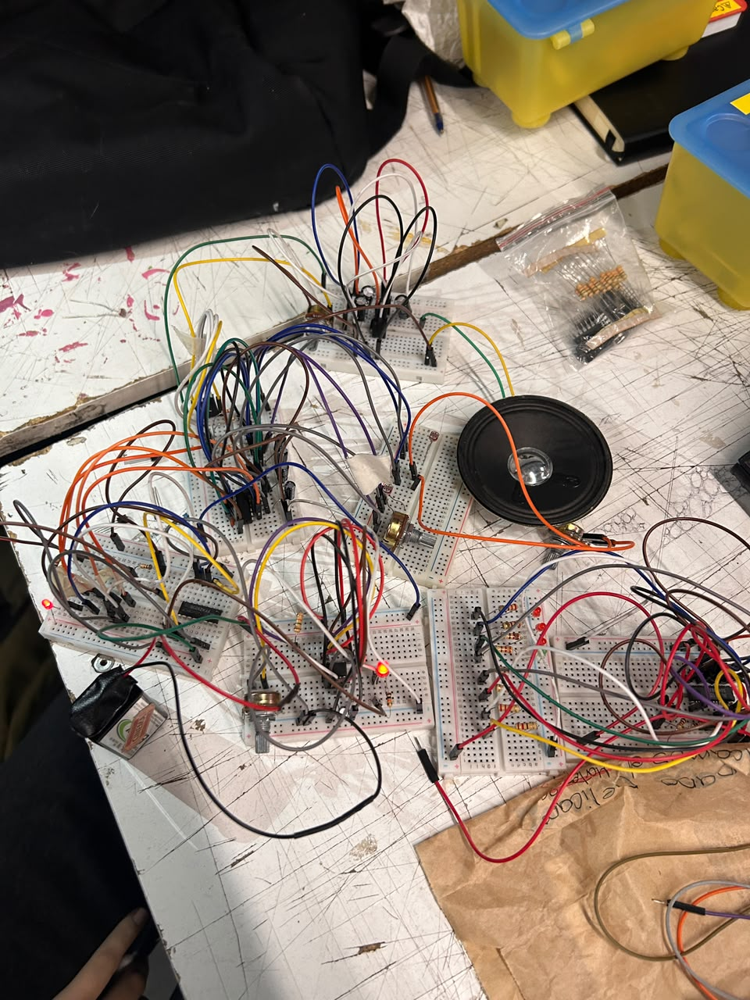
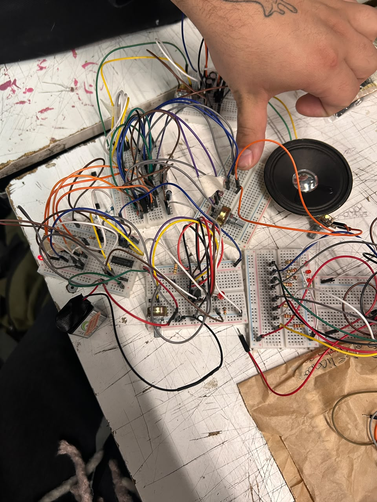
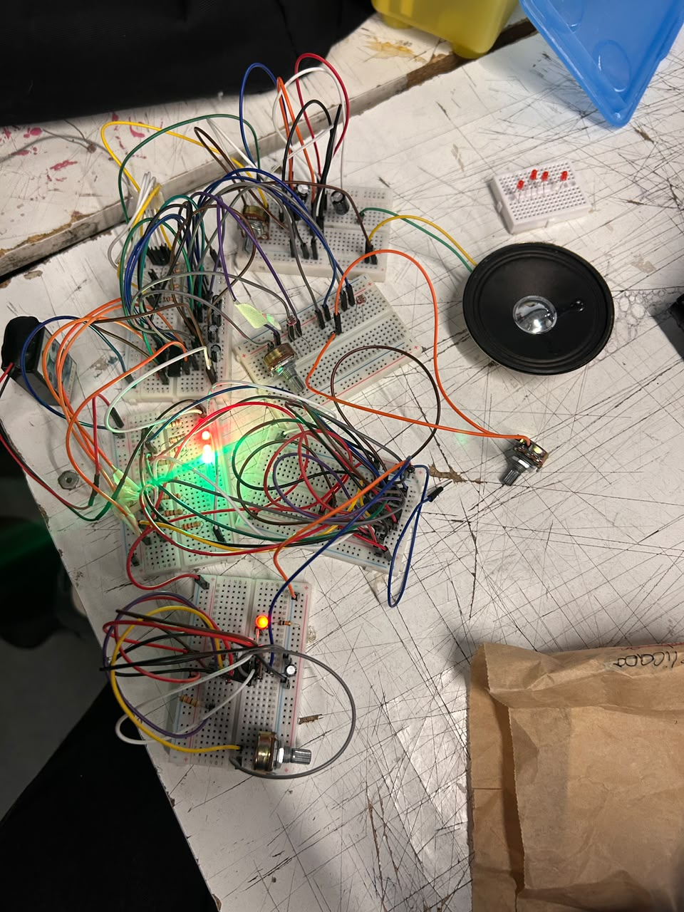
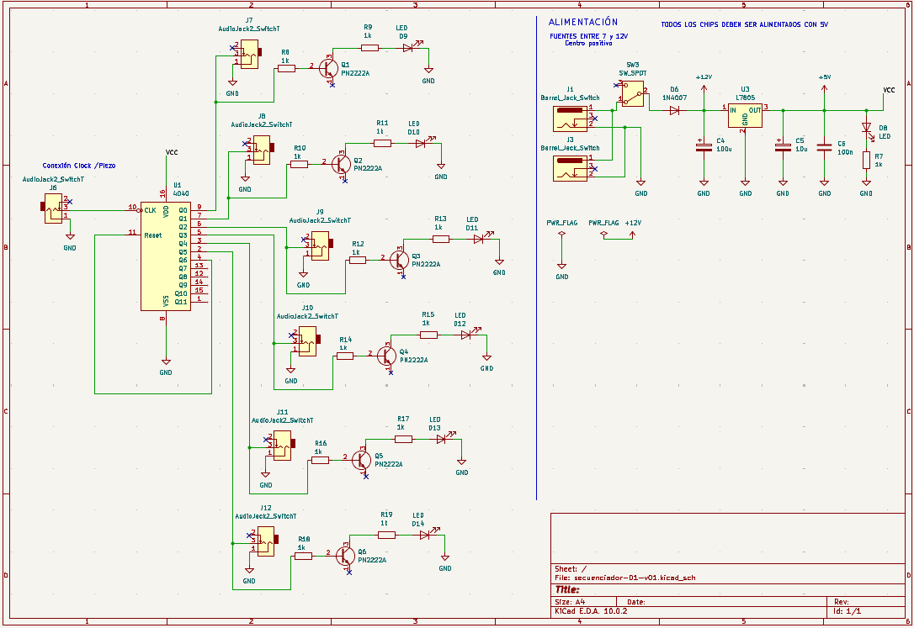

# sesion-12a

Clase 2 de junio

## **Trabajo en clases**

Durante la clase probamos el circuito 4015 y 4040 con em mix y el 4093 para verificar si de verdad funcionaba y por fin logramos que nos funcione a el primer intento ambos secuenciadores nos funcionaron bien, el sonido se escucha un poco curioso y chistoso pero nos gusto el resultado, al momento que se conecte con los osciladores dependera de como hicieron los circuitos los demas, pero en si el circuito funciona bie, tambien hicimos la prueba de ponerle transistores al 4040 y resulto muy bien, el sonido cambio u poco y la velocidad igual, pero era el resultado que buscabamos.

**Esquematico de nuestros circuitos**

**Registro del sonido subido a youtube**

https://youtube.com/shorts/Avq0Pz7RgVc?feature=share

https://youtube.com/shorts/X2s2UjBy3x8?feature=share

https://youtube.com/shorts/RLONX7Dewa4?feature=share

https://youtube.com/shorts/nYjTRhHY4o8?feature=share

https://youtube.com/shorts/8Ct2wU3u4RI?feature=share

https://youtube.com/shorts/UzTAtNhPJdo?feature=share

https://youtube.com/shorts/9iWUSzQ8m6s?feature=share

https://youtube.com/shorts/gLU3cue3pys?feature=share

https://youtube.com/shorts/OjDaB92stf0?feature=share

## **Encargo**

Cap 3 y 4:

Proyecto 02: me toco la parte de redactar nuestro proceso durante estas semana.

## **PROCESO**

Para el proyecto tuvimos diferentes etapas, iniciamos con un proceso de investigación para ver distintas opciones de secuenciadores para ver cual nos llamaba mas la atencion, como grupo llegamos con muchas opciones, vimos hasta vimos la posibilidad de no usar chip, pero nos iríamos muy en vola, después de mucha investigación y ver varias opciones llegamos a la conclusión de usar el CD4040 y CD4015, ya que estos nos permiten generar secuencias de manera distinta, igual nos aventuramos en elegir estos chips ya que nunca lo habíamos vistos y eran circuitos que encontramos en internet y no sabíamos si lograriamos hacerlo, aceptamos el desafío y fui a san diego por suministros de chips.

Empezamos hacer las primeras pruebas utilizamos el cd555, que se encarga de generar los pulsos que controlan la manera en cómo avanza el secuenciador, durante esta etapa surgieron distintos problemas, tuvimos fallas con conexiones, errores de cableado y componentes defectuosos, íbamos registrando y corrigiendo en el acto para no perdernos, esto nos permitió mejorar el funcionamiento, generar hipótesis de los posibles errores y adelantarnos a posibles fallas.

Con el CD4040 hicimos varias pruebas para ver que funcionara bien el contador binario es decir un contador de pulsos o pasos cada vez que recibe una señal, permitiendo generar secuencias y patrones de activación, comenzamos utilizando pocas salidas y a medida que veíamos que iba funcionando le ibamos agregando mas leds, para poder observar mejor la secuencia que se generaba, tuvimos fallas con la alimentación conexiones a tierra que no habíamos puesto, se nos quemaron algunos leds para variar. Cuando logramos hacer que todo esté bien conectado y arreglar todos los problemas logramos que funcionara de manera estable, y vimos cómo se comportaba y funcionaba el chip, y como son los pulsos que tiene el chip.

Hicimos pruebas conectando el CD4040 a un amplificador Lm386 para ver como se escuchaba los pulsos que obtuvimos, aunque el resultado no nos pareció muy bien osea funcionaba correctamente pero el sonido era raro, nos hizo sentir bien el haber logrado que el secuenciador funciona y qué se diferencian los pasos, el tema del sonido se solucionara cuando lo conectemos con los osciladores correspondientes.

Posteriormente empezamos con la investigación del CD4015, que es un chip de registro de desplazamiento que nos permite mover una señal a través de distintas etapas siguiendo los pulsos del reloj, debido a que este chip no estaba el kicad tuvimos que recurrir a proyectos similares y referencias externas para poder entender mejor cómo funciona y realizamos pruebas en la protoboard.

Las pruebas en la protoboard del CD4015 se nos presento distintos inconvenientes, como errores de alimentación entre placas nuevamente, malas conexiones, leds quemadas y problemas con la velocidad del reloj, después de corregir est, cambiamos los valores en las resistencias del reloj 555, logramos que funcionara más estables el circuito, esto nos ayudó mucho para poder observar cómo funciona el desplazamiento de la señal .

Hicimos investigaciones de cómo podríamos podríamos usar transistores, analizamos el funcionamiento y cómo podríamos utilizarlos para controlar cargas mayores sin exigir  las salidas de los circuitos integrados. Esta solución fue considerada especialmente para poder  incorporar leds y ver como avanzan los pasos.

Como GRUPO nos repartimos las partes de investigación diseño de esquemático documentación simulación del circuito en falstad, y pruebas en la protoboard, esto nos ayudó a avanzar de manera coordinada y que todos estemos en la misma página durante el desarrollo del proyecto, con este proyecto  logramos comprender el funcionamiento de los chips que elegimos, pudimos resolver problemas rápidamente y avanzar de una manera fluida,  y definir una dirección clara para las siguientes etapas del proyecto.

*Sigue en proceso de edicion*
