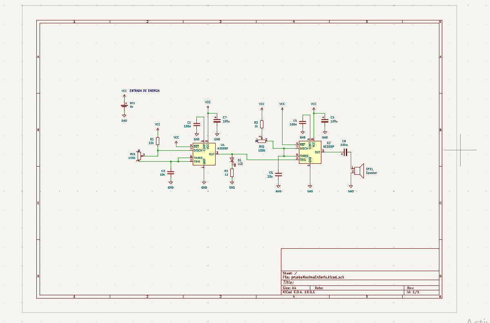
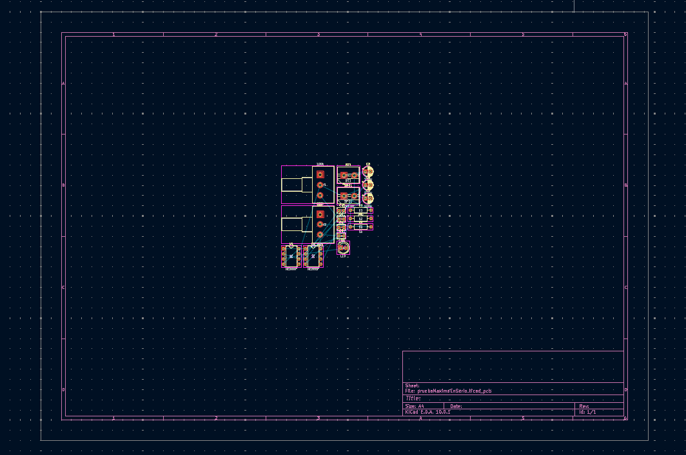
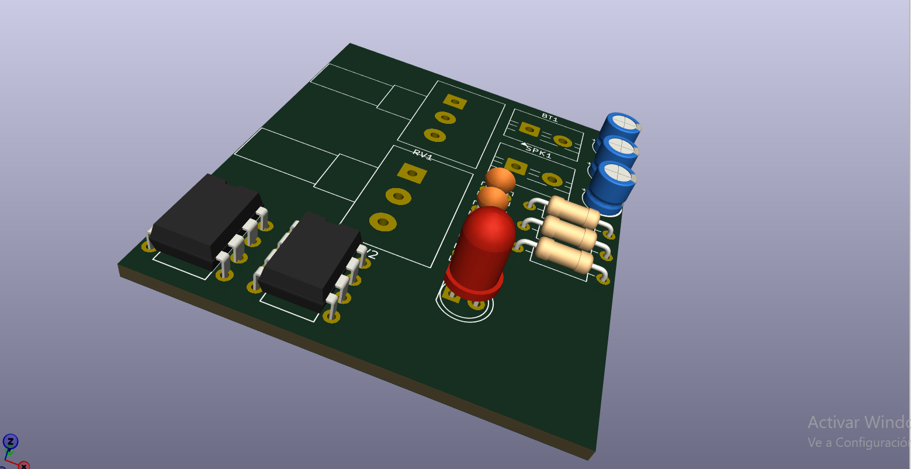
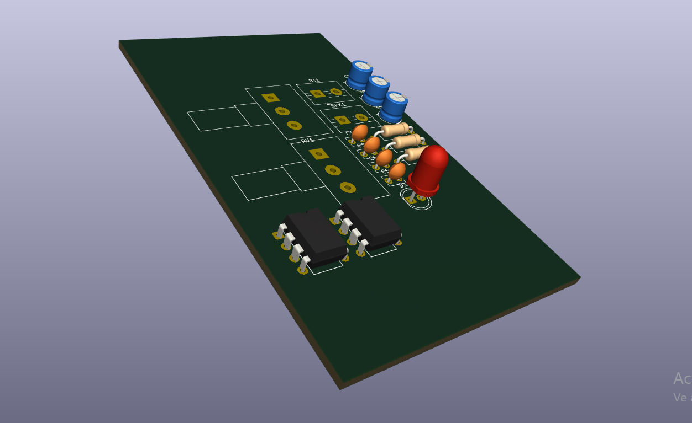

# sesion-08a

## KiCad

Es un software gratuito y open source para diseño de circuitos electrónicos y placas PCB. Permite trabajar desde el esquemático hasta la preparación final para fabricación.

## Ideas importantes

- **Símbolos** -> representan los componentes de manera abstracta dentro del esquemático.
- **Huellas / Footprints** -> representan la forma física real del componente en la PCB.

## Archivos principales

KiCad trabaja con distintos archivos conectados entre sí.

| Archivo | Función |
|---|---|
| `.kicad_pro` | proyecto principal |
| `.kicad_sch` | esquemático |
| `.kicad_pcb` | PCB |

Es importante abrir siempre el archivo `.kicad_pro`, porque desde ahí se mantienen conectados todos los demás archivos del proyecto.

## Flujo de trabajo

Durante la clase se alcanzaron a realizar los primeros pasos del proceso.

| Paso |
|---|
| Dibujar el esquemático |
| Asociar huellas |
| Abrir PCB Editor |
| Definir pistas |
| Distribuir componentes |
| Rutear conexiones |
| Preparar fabricación |

En algunos casos puede ser necesario diseñar símbolos o huellas propias, ya que no todos los componentes existen en las librerías de KiCad.

## Esquemático

El esquemático se realiza en el archivo `.kicad_sch`.

Primero se agregan componentes y luego se conectan mediante cables. Cada componente necesita un valor asignado para que el circuito pueda leerse correctamente.

## Esquemático

## Atajos

| Atajos | Componente |
|---|---|
| `R` | resistencia |
| `R_POT` | potenciómetro |
| `C`| condensador cerámico |
| `C_P` | condensador electrolítico |

## Huellas

Después del esquemático, cada símbolo debe asociarse a una huella física.

| Concepto | Significado |
|---|---|
| Símbolo | representación conceptual |
| Huellas o footprints | representación física |

## Huellas utilizadas

| Componente | Huella |
|---|---|
| Condensador cerámico | `Capacitor_THT:C_Disc_D3.8mm_W2.6mm_P2.50mm` |
| Condensador electrolítico | `Capacitor_THT:CP_Radial_D5.0mm_P2.50mm` |
| Resistencia | `Resistor_THT:R_Axial_DIN0207_L6.3mm_D2.5mm_P10.16mm_Horizontal` |
| Potenciómetro | `Potentiometer_THT:Potentiometer_Alps_RK163_Single_Horizontal` |
| LED | `LED_THT:LED_D5.0mm` |

## PCB Editor

Tenemos que apretar el boton verde que aparece arriba a la derecha para poder asi poder pasar a la visualizar lo que es la PCB

## PCB

Aquí la vista 3d de como se veria la PCB

## Atajos útiles

| Tecla | Acción |
|---|---|
| `A` | agregar componente |
| `V` | cambiar valor |
| `M` | mover |
| `R` | rotar |
| `X` | reflejar |
| `W` | dibujar cables |
| `E` | abrir propiedades |
| `G` | agarrar componente |
