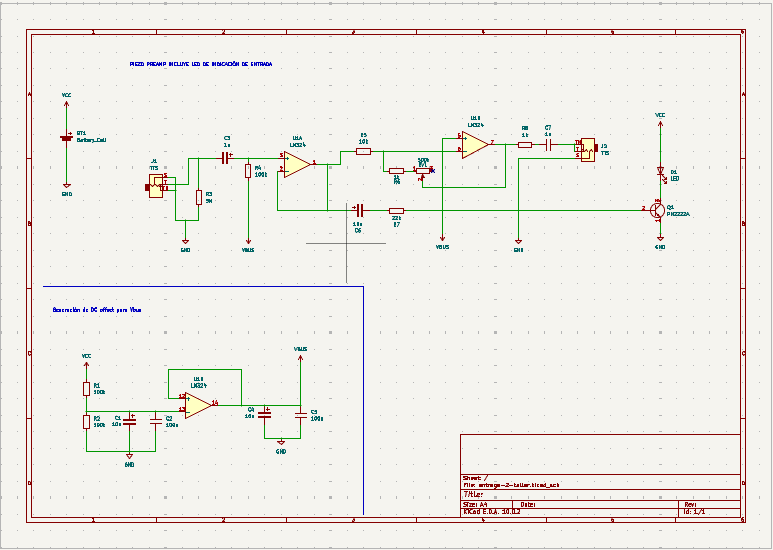
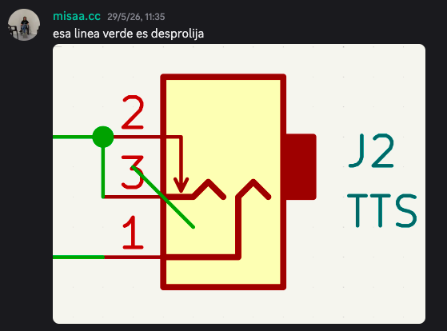
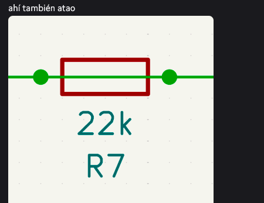
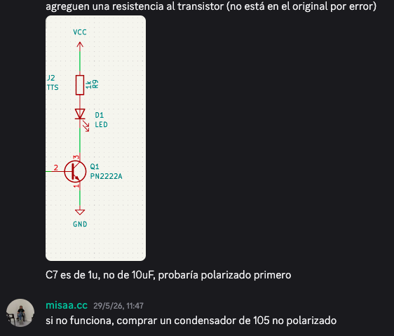

# sesion-11b

En esta clase nos concentramos nos separamos en dos grupos unos se encargaron de hacer algunas cosas para el piezo-01 y los demás en seguir arreglando el piezo-02. Yo estaba en el piezo-02.

No entendíamos qué estaba pasando y el porqué no funcionaba y le preguntamos a misaaaaaa que podíamos hacer, que porque no estaba funcionando. Nos pidió que le enviaramos el proyecto para que lo revisara y viera si es que había errores y descubrió los siguientes:

Luego de esos fallos, los arreglamos y aun así no funcionaba. La teoría es que el cerámico 105 (el de 1u), es bastante importante y sin él, el circuito no funciona. 

### Antes del trabajo en grupo

Vimos algunos conceptos, no pude anotar todo pero me quede con este.

Maniqueísmo: el universo está regido por dos fuerzas cósmicas, la luz que es el bien y la oscuridad que es el mal.

## Entre clase

Aarón y misaaaaaa trajeron donuts y estaban buenísimas, gracias por todo y perdón por tan poco.
