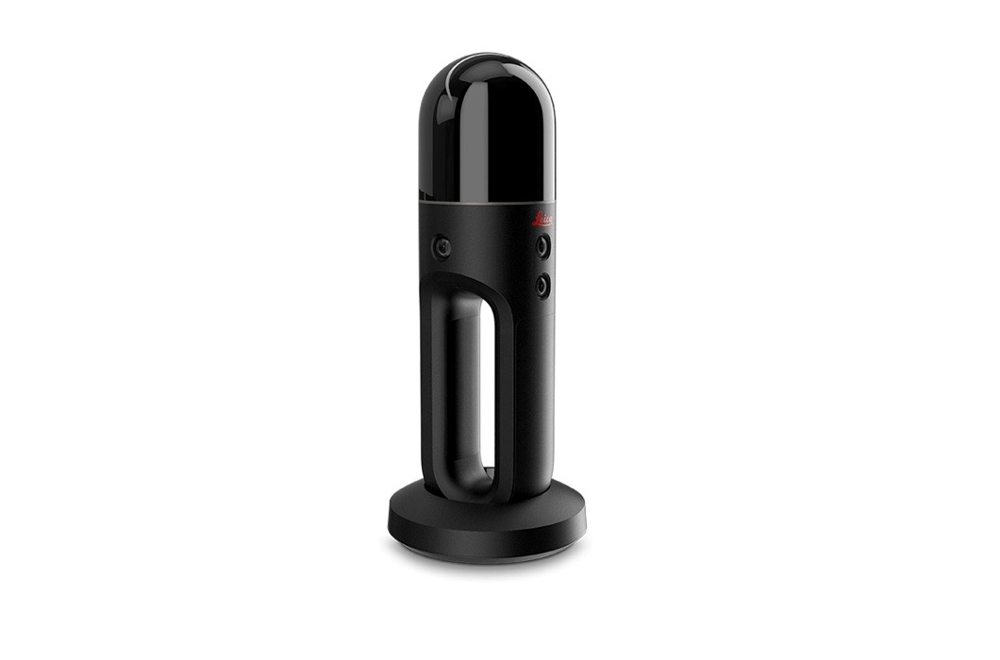
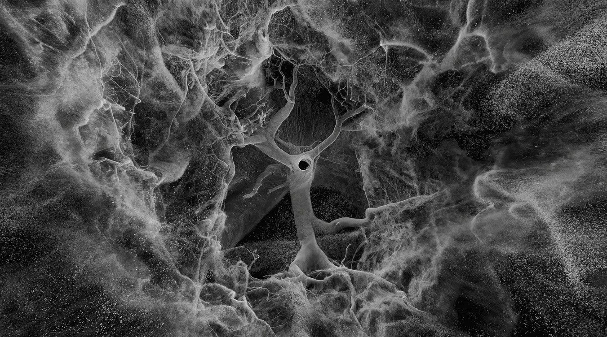

# sesion-10a
19 de mayo del 2026  
Hola profe Misa, Aarón y Emi, les mando un abrazo y veamos que tenemos para hoy.

1.	Charla sobre la presentación de la próxima exposición; For want or (not) measuring (Para querer o no medir).
2.	Conceptos de; pensamiento objetivo, y pensamiento sistémico.
3.	Clase sobre algunos chips osciladores.
4.	Clase sobre algunos chips osciladores y algunos amplificadores.
5.	Flusser, cap. 4, 5

> ***Así termino el tablero este día:***
>> 

## 1.	Charla sobre la presentación de la próxima exposición; For want or (not) measuring (Para querer o no medir).

Esta charla a la cual asistimos todxs mis compañerxs de clase y yo, fue principalmente para informarnos sobre este proyecto llamado **“For want or (not) measuring”** de un grupo de personas muy talentosas, que vienen de England a compartir su arte y su exposición en Santiago de chile, en el museo CEINA.

Esta exposición fue creada originalmente como un proyecto colaborativo entre 2 artistas, los cuales se llaman; *Jim Hobbs* y *Patrick Adam Jones* *(de hecho, participaron más personas, pero no recuerdo sus nombres).* Ambos hicieron la idea de este proyecto a partir de una investigación artística sobre los sistemas de medición, la percepción y la imposibilidad de comprender completamente el mundo mediante datos o métricas. 

Esto suena muy técnico, pero lo mágico es como comparten esta reflexión y visión a manera de exposición. Esto lo hacen con la ayuda de un scanner que mide el espacio de los sitios o los objetos como con un sistema de puntos. Luego, generan un render 3d y este se vuelve la base del arte; pues desde allí manipulan estos cálculos obtenidos del scaner.

Con lo anteriormente mencionado, el scanner está hecho para scannear lugares cuadriculados, y ellos también lo usan para scannear objetos como: Arboles, nubes, montañas, cosa que principalmente para eso no fueron creados esos instrumentos, pero ellos lo usan de esa manera también para resaltar este concepto de **“Medir o medir pero sin el propósito de medir rígidamente como para lo que fue diseñado ese objeto”**, y bien; de allí surgen imágenes totalmente locas, y también hacen de estas imágenes o producciones audiovisuales, algo interactivo; como que reaccionen al movimiento de las personas, o al ruido. Es totalmente increíble lo que ellos hacen.

**Así es el scanner:** 

**Así se ven los scanners que hacen, y este es el del interior de un árbol:**

## 2.	Conceptos de; pensamiento objetivo, y pensamiento sistémico.

| ***Pensamiento Objetivo*** | ***Pensamiento Sistemático*** |
|----------------------|-------------------------|
| El pensamiento objetivo es la capacidad de analizar una situación basándose en hechos, evidencia y lógica, en vez de dejarse llevar solo por emociones, prejuicios o suposiciones.    Implica observar las cosas “como son”, considerando distintos puntos de vista y separando lo que siento de lo que realmente está ocurriendo. | El pensamiento sistemático es una forma de analizar situaciones entendiendo cómo las distintas partes de un sistema se relacionan entre sí.    En vez de ver un problema aislado, busca comprender causas, consecuencias, patrones y conexiones para tomar decisiones más completas y estratégicas.    (Y nosotrxs, usamos este pensamiento en la clase de taller por las interconexiones que se pueden hacer, en este caso, entre las partes del mega synth que vamos a hacer). |

## 3.	Clase sobre algunos chips osciladores.

Los Osciladores Controlados por Voltaje, son circuitos electrónicos que generan una señal como una onda, *(una señal que oscila jiji),* y la frecuencia cambia dependiendo del voltaje de entrada.

Y estas oscilaciones, se controlan con los potenciómetros, que son lo que nos permiten jugar con el flujo de la energía. 

## 4.	Clase sobre algunos chips osciladores y algunos amplificadores.
### **Chips Osciladores:**

| Chip | Descripción |
|------|-----|
| `4046`  |Circuito PLL (Phase Locked Loop) que incluye un VCO integrado. Muy usado, en síntesis, generación y sincronización de señales.    (El término PLL (Phase Locked Loop) significa que el circuito “escucha” una señal externa y ajusta su propia frecuencia para mantenerse sincronizado con ella. Y como trae un VCO integrado, se puede controlar la frecuencia usando voltaje.)    En sintetizadores se puede usar para; crear tonos, sincronizar osciladores, y hacer efectos electrónicos interesantes.|
| `4051` | Multiplexor/Demultiplexor analógico de 8 canales. Sirve para seleccionar una señal entre varias entradas. Este chip funciona como un selector electrónico. Po ejemplo: tienes 8 señales diferentes, pero quieres elegir solo una a la vez.    Se usa para: seleccionar sensores, enrutar audio, cambiar señales en sintetizadores, ahorrar conexiones y componentes.*(Con este también podría hacer un secuenciador jiji para la solemne).*

### **Chips Amplificadores:**
> *(“Op-amp” significa amplificadores operacionales)*

| Chip | Descripción |
|------|-----|
| `LM 741` |  Amplificador operacional clásico (op-amp).  |
| `LM 358` | Doble amplificador operacional. Tiene 2 op-amps dentro del mismo chip y funciona bien con una sola fuente de alimentación.|
| `LM 324` | Cuádruple amplificador operacional. Incluye 4 op-amps en un solo chip. |

## 5.	Flusser, cap. 4, 5

#### Capítulo 4: El acto de fotografiar 

“Una fotografía es una imagen de conceptos”  
En este capítulo, el autor hace una gran metáfora para explicarnos su reflexión, y es que, el acto de fotografiar es como un acto de “cacería”. Con lo anteriormente mencionado, entremos en materia.

El autor comienza el capítulo realizando esa metáfora (de cacería), porque la acción de tomar una foto parece que se está pendiente a capturar algo, y se hace. En la fotografía, esta cacería ocurre en un denso bosque de objetos culturales [por los cuales estamos mediados, a su vez nuestros intereses personales e intenciones], esto también hace referencia a la cultura de nosotrxs poder escoger que objetos queremos que estén en el encuadre y “escenario” de la fotografía (escoger los objetos que queremos cazar)…, es un acto intencionado. Bien, todas estas estructuras culturales se ven en el acto mismo del fotógrafo, o eso es lo que se cree, pues el autor luego menciona que estas condiciones culturales son filtradas por el aparato “la cámara”, siendo cubiertas e indescifrables por el programa de la cámara (a los observadores), y el resultado de esto; una cultura de masas general y uniforme generada por los aparatos. 

Luego el autor, habla sobre el poder de la fotografía y el fotógrafo al trabajar y moverse en el espacio-tiempo, pues el fotógrafo tiene el poder de mover los objetos dentro del marco de su cámara para sacar una foto con mayor o menor información (haciendo referencia a que la información serían los objetos puestos en escena) en un escenario y tiempo determinado, y combina estas acciones para poder obtener un producto final. Además, el uso o la manipulación de las configuraciones (ya sea las configuraciones de modo de foto, ráfaga, fotos en movimiento, o de noche, etc), hacen parte de este “juego” de fotografiar. Pero aquí el autor hace una reflexión cuando comenta que al parecer nostrxs los seres humanos tenemos la libertad o parece que tenemos la libertad y control de la cámara para poder materializar nuestras intenciones por medio de la fotografía, pero no es así, pues los fotógrafos trabajan o hacen hasta donde el programa dentro la cámara les permita, por eso el autor dice “La elección de un objeto es libre, en tanto que el objeto esté en armonía con el programa de la cámara”. 

Continuando con el texto, el autor habla como fotografiar (con lo anteriormente mencionado), se convierte en un acto de buscar las posibilidades no descubiertas dentro del programa de la cámara, porque ella es la que condiciona todo, y es por esto que siguiendo este orden de ideas, se marca una gran distinción entre realismo e idealismo la cual es superada por la fotografía, pues “el mundo exterior” deja de ser lo real, lo mismo sucede con la “intención” del fotógrafo o la condición de la cámara…, lo que es “real”, es o sería la imagen como tal. Es aquí donde el autor menciona una palabra clave, haciendo mención de que; el acto de fotografiar es un acto de “duda fenomenológica”, porque hay dos elementos esenciales, los cuales son; El fotógrafo actúa de forma posideológica (diversos puntos de vistas e ideologías), y la practica de la fotografía esta sujeta a un programa, pues el fotógrafo solo puede actuar  dentro de un programa (valiendo la redundancia), y esto lleva a que se considere que lo “real” sea la información en sí misma (lo literal que nuestrxs ojos ven en la imagen), y no el significado de esta. A esto se le suma que una de las maneras de saber la intención del fotógrafo, es viendo una serie de sus fotografías, ya que ninguna foto individual es decisiva. (pero esto se ve mejor en el cap 5).

Para ir culminando este texto, el autor propone que el fotógrafo y la cámara se unen para convertirse en una sola función, buscar información, y es la fotografía el producto del acto fotográfico.
Fin. 

#### Capítulo 5: La fotografía 

“Existe una diferencia entre nosotrxs lxs lectores de este libro, y las personas allá afuera que dan por hecho que las fotografías son el mundo exterior (literalmente)”. 
Con lo anteriormente dicho, comencemos con el resumen del capítulo: 
Hasta ahora, este es uno de los mejores capítulos que me he leído del libro, porque siento que de alguna manera es muy cercano e íntimo. El autor comienza comentando que las fotografías son omnipresentes, haciendo referencia a que el significado real de la fotografía hay que decodificarlo, pensar por fuera de la “imagen” que tomamos como verdadera, pues todas las imágenes significan conceptos, y estas tienen la intención de programar la conducta mágica de la sociedad (esto lo sabemos nosotrxs porque hemos leído este libro y nos ha hecho reflexionar sobre esto), pero esto no es conocido o obvio para las personas observadoras, ya que estas consideran las fotografías como situaciones literales provenientes del mundo exterior. (por eso el autor dice; El observador ingenuo admite tácticamente que puede ver el mundo a través de las fotografías).

Luego, el autor habla sobre las fotografías en blanco y negro, y como en contraste en el mundo exterior no podemos encontrar situaciones así tan limitadas…, y les llama situaciones ideales y teóricas (porque en realidad no tenemos nada así, realmente). Y es aquí donde el autor nos cuenta que si situaciones en blanco y en negro existieran, el mundo podría analizarse lógicamente al tener dos extremos…, pero en medio del blanco y el negro, hay una escala de grises. Como dice en la lectura, en realidad el mundo no se limita en blanco y negro, en verdadero o falso o, lo bueno y lo malo, porque ninguna acción es totalmente blanca, verdadera o buena, o, totalmente negra, falsa o mala.

Muchos fotógrafos prefieren las fotografías en blanco y negro porque reduce su significado o sus opciones de conceptos. (es aquí donde el autor trae sobre la mesa algo que wow). Sin embargo, las fotografías a color son tan teóricas como las blanco y negro, incluso, más engañosas, pues los colores en las imágenes son conceptos del color real del mundo exterior…, y esto hace que; entre más verdaderos sean los colores en una fotografía, más engañosa será esta. Y como las fotografías son un conjunto de símbolos que significan conceptos abstractos, será más difícil descifrar el verdadero significado de esa fotografía. (porque estos conceptos abstractos, se hacen más abstractos a la fotografía parecerse más al mundo real).

Luego el autor menciona que basta con descifrar las intenciones del fotógrafo y la cámara, a partir de la fotografía…, pues una vez que se descifra la intención codificadora (de la cámara), se puede descubrir la intención del fotógrafo. Y pone lo anteriormente dicho como un “limite” de descifrar, porque si queremos ahondar más en querer descifrar, será un hoyo casi que infinito intentar descomponer y querer entender todo. Continuando con lo anteriormente dicho, la intención del fotógrafo es hacerse inmortal en la memoria de otras personas, informando a esas personas mediante fotografías, sus conceptos. En cambio, el programa de la cámara intenta realizar una mejora constante con la retroalimentación de la sociedad para un continuo mejoramiento del programa.

Para finalizar este texto, las fotografías son conceptos que son reformularon en situaciones de espacio y tiempo, lo cual demuestra que como espectadores tenemos la tarea de descifrar las codificaciones relacionadas a cada fotografía. Debemos criticar y analizar, pues si aceptamos de manera literal y acrítica las fotografías, ellas estarían sirviendo a su propio propósito o fin; “programar a la sociedad para una conducta mágica al servicio de las funciones de los aparatos”. ¿Y el mundo real?
