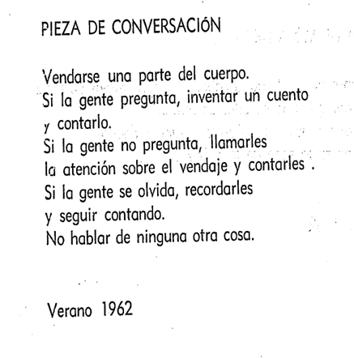
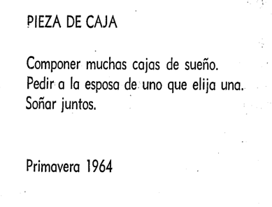
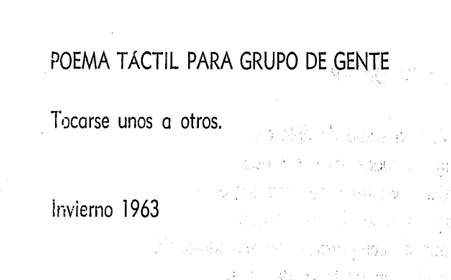
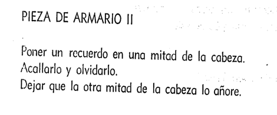

# sesion-13b
**12 de junio del 2026**

Hola profe Misa, Aarón y Emi. Espero que la estén pasando bien en el momento que se encuentren leyendo estos textos. Veamos que hicimos el día de hoy:

1.	Hablamos sobre las partituras  
2.	Ajustes, avances y puntos clave para la entrega del proyecto 3 (partituras).  
3.	Ono, cap. 3, 4

---

## 1.	Hablamos sobre las partituras  

En el comienzo de clase, se empezó hablando sobre las partituras y entendimos que no existe una única forma de hacer música, comunicarla y entenderla. Las partituras funcionan como una representación visual que permite comunicar ideas musicales mediante distintos símbolos (como lo son las partituras). Gracias a ellas, para nosotros es posible identificar aspectos como los sonidos, que duración queremos que tenga, la velocidad y la intensidad.

Y fue aquí donde vivos algunos ejemplos de partituras experimentales, como esta de John Cage:

---

## 2.	Ajustes, avances y puntos clave para la entrega del proyecto 3 (partituras).  

- En esta clase, mi grupo y yo estábamos un poquito tostadesss, porque como no sabemos como va a sonar el synthe, no podemos como imaginar algún concepto que nos llene las entrañas, pero bueno, supongo que ese será el reto.     Pero mientras, comenzamos a tener una lluvia de ideas sobre las posibles partituras experimentales que realizaríamos, y tuvimos la idea de integrar el cuerpo con el sonido, o sea, que la partitura haga que la o el espectador tengan que involucrarse. 

- También estuvimos viendo que posibles controladores de energía podríamos usar, para reemplazar los potenciómetros, tales como: **LDR, softspot y termistor.**
  

- Para culminar este apartado, escogimos también las placas con las cuales vamos a trabajar, las cuales son: 

> •	Chirihue Mecanizado (Pájaro) – oscilador

> •	Secuenciador 02 – Grupo (<https://github.com/santiagocifuvelez/dis8644-2026-1-procesos-2/tree/main/00-proyecto-03/grupo-02>) 

> •	Relo - Clock - Misa y Áaron (profes)

Avance del primer BOM
| Componente | Cantidad | Valor unitario | Link/Comprar |
|------------|----------|--------------|---------|
| Chip 40106 | 1 | $1.200 CLP | https://electronicareal.cl/producto/integrado-digital-cd-40106/?srsltid=AfmBOopGygR12K2_-zL_pf-RaOB5PvLmK7oy2TURaqkeA0zU1alOhJD- | 
| Chip LM324 | 1 | $590 CLP | https://www.mechatronicstore.cl/amplificador-operacional-lm324/ | | Regulador L7805 | 1 | $350 CLP | https://www.victronics.cl/reguladores/reguladorvoltl7805cv5v-15ato220/ | 
| Condensador 10 µF | 3 | $330 CLP | https://www.victronics.cl/condensadores/condensadorelectrolitico10uf50v/ | 
| Condensador 100 nF | 2 | $100 CLP | https://www.mechatronicstore.cl/condensadores-ceramicos-distintos-valores/ | 
| Condensador 100 µF | 1 | - |  | 
| Diodo 1N4148 | 4 | - |  | 
| Diodo 1N4007 | 1 | - |  | | Potenciómetro 100 kΩ | 4 | $495 CLP | https://altronics.cl/potenciometro-lineal-100k-b100k | 
| Resistencia 1 kΩ | 6 | $100 CLP | https://www.mechatronicstore.cl/resistencia/ | | LED | 2 | $300 CLP | https://www.mechatronicstore.cl/led-intermitente-5mm/ | 

---

## 3.	Ono, cap. 3, 4

### Capítulo 3 — Evento

Lo que más me llamo la atención de este capítulo, es la capacidad de la autora de contar como de forma “humorística” o como “fuera de un contexto” al que estamos acostumbrados a escuchar o ver ciertas cosas, ciertos eventos que creo que todxs sin excepción hemos ya hecho o al menos pensado; Por ejemplo, este texto, lo sentí muy familiar: 

Porque la primera vez que me fracture, actúe como “Una pieza de conversación”. 
También me encanta que haga palabras tales como; pene, púbico, soñar…

Agregando a lo anterior, me gusta que, en este capítulo, se nombra mucho la presencia de la otra persona, por ejemplo, esto me pareció muy romántico: 

### Capítulo 4 — Poesía

Este capitulo en particular, se llama poesía, pero yo creo que todo este libro ha sido poesía. No hay pena, es muy muy humano, y esto se demuestra en la manera en la que este comienza, y en la que termina, pues inicia la autora haciendo su trabajo de escribir como estos textos cortos y controversiales, y finaliza con su lista de compras, exponiendo así que las personas que escriben libros o que la persona que escribió ese libro, es una persona con pelos púbicos, con una vida humana y necesidades que todxs tenemos en común, como lo es, salir a comprar el mercado. 

Nunca paremos de tocarnos unxs con otrxs.

También, la añoranza de lo ya vivido, como la ropa de closet que repentinamente recordamos que tenemos, y vamos a buscarla con mucha añoranza y felicidad. (Yo creo que por eso se llama así el titulo de este texto). 

fin. c:
