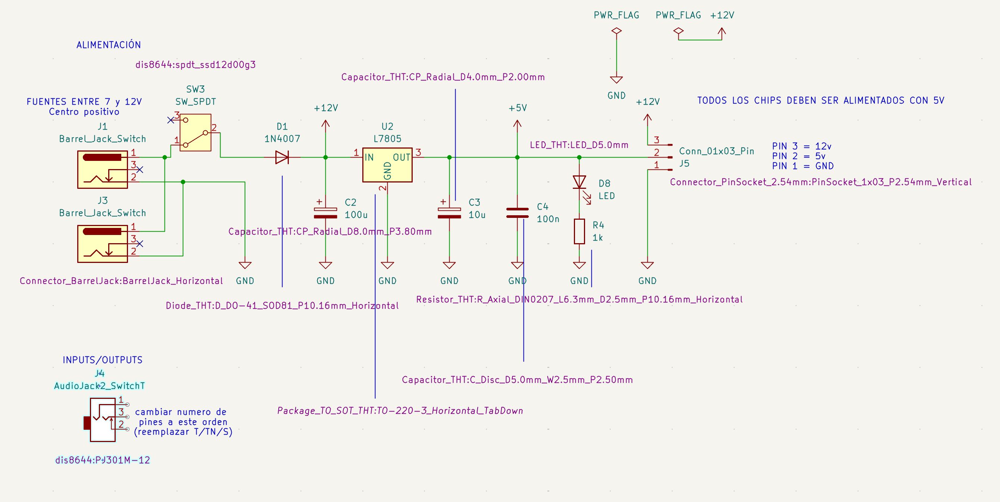

# sesion-11a

Martes 26 de mayo

Durante esta clase se continuó trabajando en ambos piezos, el día anterior (lunes 25) nos juntamos, en el piezo 01 en un momento dejaban de prender los leds y se arreglaba desconectando el cable que estaba en el reset del 4017, dejarlo al aire un ratito y volver a conectarlo, no se supo el por qué… misterio…

Después de las correcciones de Misa quedó funcionando.

Respecto al piezo 02, tuvimos que rearmar el circuito porque no estaba funcionando. Para facilitar el trabajo y mejorar la distribución de los componentes, lo montamos nuevamente en una protoboard más larga ( ദ്ദി ˙ᗜ˙ )

Luego en clase seguimos sin tener éxito con el piezo 02 T T

---

Misa y Aarón presentaron el nuevo estándar para la sección:

| Componente  | Valor            | Huella                                                         |
|-------------|------------------|----------------------------------------------------------------|
| Condensador | 100u             | Capacitor_THT:CP_Radial_D8.0mm_P3.80mm                         |
| Condensador | 10u              | Capacitor_THT:CP_Radial_D4.0mm_P2.00mm                         |
| Condensador | 100n             | Capacitor_THT:C_Disc_D5.0mm_W2.5mm_P2.50mm                     |
| Diodo       | 1n4007           | Diode_THT:D_DO-41_SOD81_P10.16mm_Horizontal                    |
| LED         |                  | LED_THT:LED_D5.0mm                                             |
| Conector    | DC               | Connector_BarrelJack:BarrelJack_Horizontal                     |
| Conector    | Audio            | dis8644:PJ301M-12                                              |
| Conector    |     Alimentación | Connector_PinSocket_2.54mm:PinSocket_1x03_P2.54mm_Vertical     |
| Resistor    | 1k               | Resistor_THT:R_Axial_DIN0207_L6.3mm_D2.5mm_P10.16mm_Horizontal |
| Switch      | spdt             | dis8644:spdt_ssd12d00g3                                        |
| Regulador   | L7805            | Package_TO_SOT_THT:TO-220-3_Horizontal_TabDown                 |
