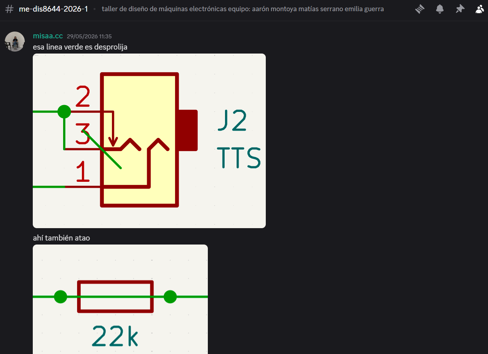
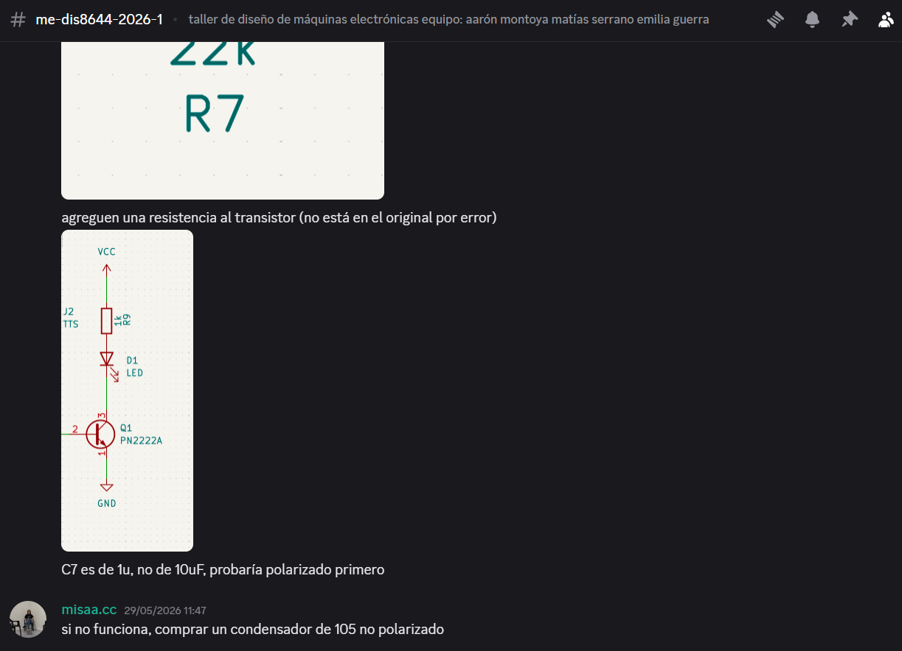
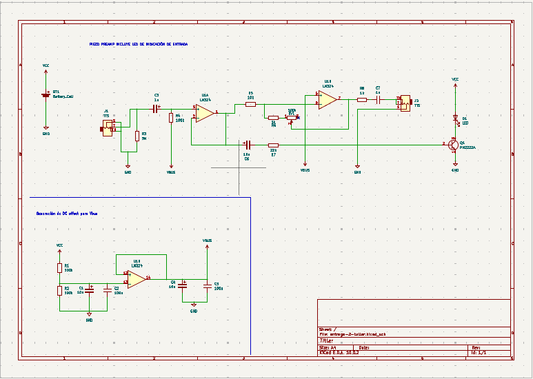

# sesion-11b

Viernes 29 de mayo

**Maniqueísmo:** el universo está regido por dos fuerzas cósmicas opuestas: la luz, que representa el bien, y la oscuridad, que representa el mal.

**Lógica aristotélica:** A = A 

---

Al comenzar la clase, retomamos el trabajo del piezo 02, ya que seguía teniendo problemas. Como no conseguíamos identificar el error, le pedimos ayuda a Misa para revisar el circuito.

Tras observar el esquemático, notó algunas cositas raras y nos solicitó el archivo de KiCad por Discord para analizarlo con más detalle. Luego de revisarlo, nos respondió lo siguiente:

Los errores fueron arreglados ( ദ്ദി ˙ᗜ˙ ) peeero en la protoboard seguía sin funcionar, pensamos que no está funcionando como debería ya que nos falta el cerámico de 105 (1u) por lo que fuimos el día lunes 
1 a comprarlo B)

Pd: gracias por las donas!!! 

