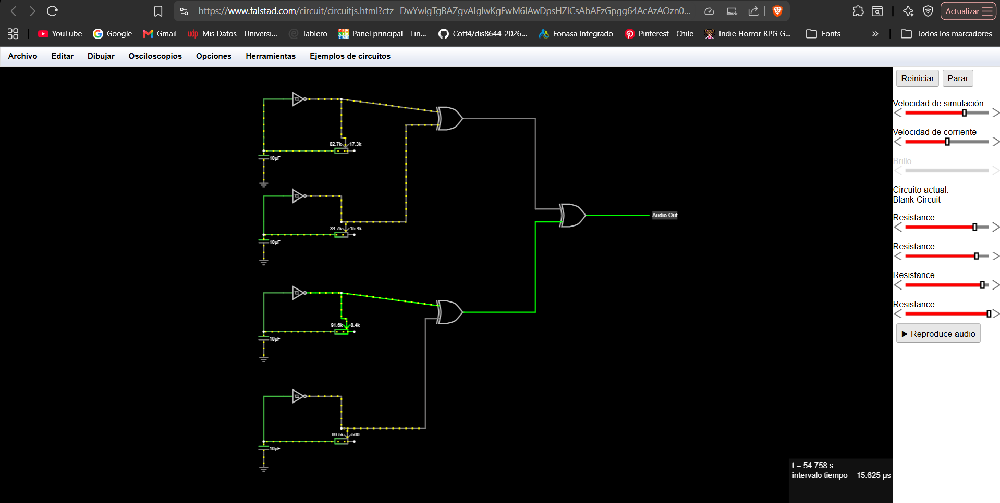

# sesion-11b
## Viernes 29 de mayo del 2026

### Proceso en clases

Durante la clase estuvimos desarrollando los entregables del circuito n.º 2, replicando el esquemático en KiCad, haciendo una simulación en Falstad y desarrollando el circuito en la protoboard por mientras, ya que aún no teníamos el chip 4070, que es un poco difícil de conseguir, pero no imposible.

### Protoboard

Para avanzar con el segundo circuito en la protoboard, aprovechamos de posicionar todos los componentes donde deberían estar. Para reemplazar la posición del chip 4070, momentáneamente pusimos un chip con la misma cantidad de pines o patitas.

Como no tenía el chip, no producía sonido.

### Falstad

Desarrollamos el circuito en Falstad para ver una simulación del sonido y funcionamiento en tiempo real.

Este circuito en específico genera dos tipos de ondas que, combinadas, las hacen inconstantes.
(perdón si mi terminología no es la adecuada)

### KiCad

Estuvimos replicando el esquemático extraído del libro **Make: Electronic Music from Scratch**.

