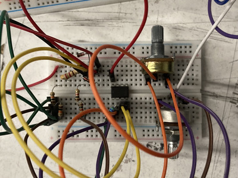
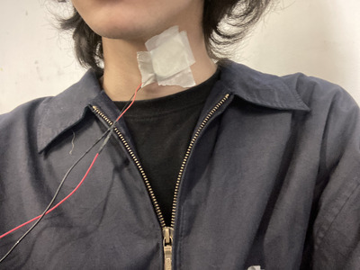
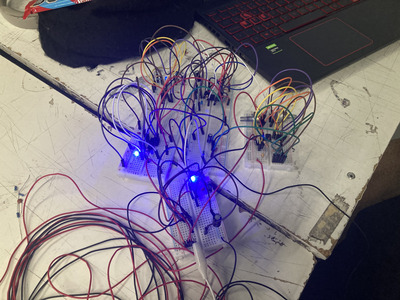
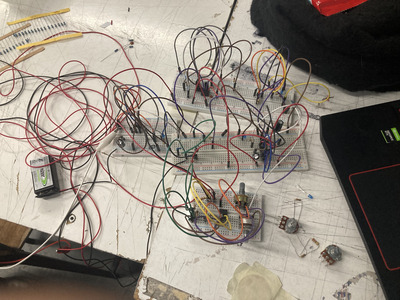
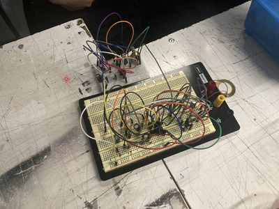
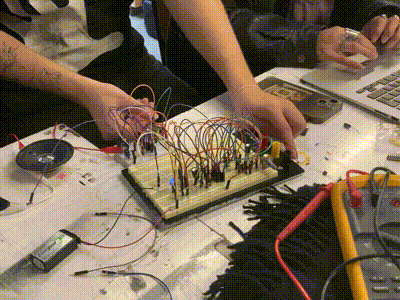
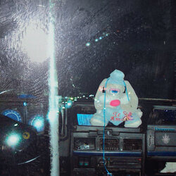

# sesion-12a

- ## arreglos piezo 01
  - la sesión pasada buscamos una manera de hacer que el piezo fuera más sensible
    - lo logramos con un amp usando el tl072
      - pero era muy poco estable
      - al rato de usarlo dejó de funcionar y no logramos hacerlo funcionar nuevamente
     
  - el martes 02/06 buscamos una alternativa estable
    - llegamos a este amp
      - 
        - la gracia de este nuevo amp es que uno puede regular la sensitividad del piezo
          - eso sí tuvimos que hacer algunos cambios para que calce más con lo que queríamos hacer
            - le preguntamos a misaaaaa que valores podriamos cambiar para hacer que captara más señales/vibraciónes
              - R4 y R5 son valores que podemos cambiar, mientras más grande la diferencia de valores
                - más sensible va a ser el piezo
              - cambiamos R4 por una resistencia de 47 Ω y mantuvimos R5 con 100K Ω
              - 
                - con esto logramos que el piezo detectara golpes a varios centimetros al pegarlo en una muralla/mesa
                  - e incluso que detectara las vibraciónes en el cuello de personas
                    - 
                    - 
                      - aquí esta nuestro compañero hablando hacia la dirección del piezo
                        - no entra en contacto fisico con el y de todas maneras el piezo detecta la vibración y hace que el 4017 del circuito avance
      - ### circuito final piezo 01
        - 
        - 
       
    ----------------------

    - ## arreglos piezo 02
      - estabamos viendo como hacer funcionar el piezo 02
        - seguimos el esquematico pero no funcionaba por alguna razón
        - 
          - los profes nos indicaron que para ver si realmente estaba bien hecho, podíamos conectar un parlante
            - si suena, está bien
            - 
              - aquí está el parlante con amp y parlante funcionando
                - el parlante eso sí no está reaccionando como teníamos planeado
               
   ----------------------

  - ## Audiomapa
  - https://www.audiomapa.org
    - proyecto que recopila sonidos del mundo
      - enfocandose más que nada en latinoamerica
        - me encantó esta pagina ya que a mi parecer es muy importante archivar sonidos ambientales/naturales
          - con esto me refiero a sonidos **no** fabricados o planeados
            - al meterme en la pagina apreté la opción de sonido aleatorio
              - entré a un supermercado en estados unidos y se podia escuchar a la gente escaneando sus productos, gente hablando, un infante llorando etc...
            - para mí es importante archivar todo (libros, videos, sonidos, objetos, comerciales, ideas, plantas, investigaciónes etc...)
              - y que cualquier persona independiente de donde sea pueda aportar a este archivo me hace feliz
      - además tienen licencias con Creative Commons para que todo lo que se sube pueda ser usado de manera libre (no comercial)
        - algo que me gustó mucho fue que cada sonido además de ser categorizado por lugar, tiene etiquetas de que es
          - animal/insecto
          - cultural
          - politicos
          - rural
          - urbano
          - etc...
      - me encantaría aportar con alguna grabación y ayudar a conservar sonidos del día a día

  ----------------------

  - ### mini recomendación musica
    - 
    - https://xweed420x.bandcamp.com/album/amor-de-encava
      - "amor de encava - weed420"
        - son un colectivo de de venezuela
          - exploran y tratan memorias y politica
            - con reggaeton, salsa, rap, epic collage y noise
        - para mi uno de los proyectos latinoamericanos más interesantes de los ultimos años
          - no les da miedo hacer musica más "rara"
            - necesitamos más musica rara, hay que expandir los limites de lo que se considera "musica"
