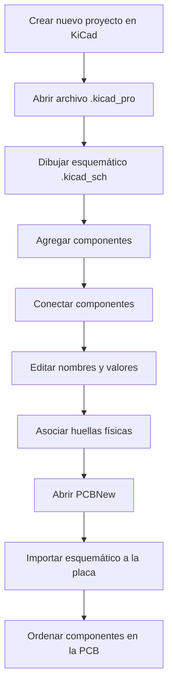

# 🌸 sesion-08a
!Bienvenidos a [](https://www.youtube.com/channel/UCietjxpksncMdOUkycv5nqA)

> **Bitácora de clase — Diseño de circuitos y placas PCB**  
> En esta sesión comenzamos a trabajar con KiCad para pasar de un circuito esquemático a una placa física.

---

## ✨ Resumen de la clase

En esta clase empezamos a trabajar con **KiCad**, un programa utilizado para diseñar circuitos electrónicos y placas PCB. La idea principal fue comprender cómo un circuito puede pasar desde una representación digital y esquemática hacia una placa física, tangible y lista para ser fabricada o soldada.

Lo más importante fue entender que KiCad no se usa solamente para “dibujar cables”, sino que permite organizar todo el proceso de diseño electrónico. Primero se construye el **esquemático**, que funciona como el mapa del circuito. Luego se asocian las **huellas físicas** o *footprints* a cada símbolo, lo que permite definir cómo se verán los componentes reales sobre una placa. Finalmente, el diseño se lleva al editor de PCB, donde se comienza a trabajar con la distribución física de los componentes.

Durante la clase también vimos referencias interesantes, como **Winterbloom**, una empresa relacionada con sintetizadores hechos en KiCad y proyectos de código abierto. Esto me ayudó a entender que KiCad no solo sirve para hacer ejercicios de clase, sino también para desarrollar proyectos reales, creativos y funcionales.

---

## 🧭 Flujo general de trabajo en KiCad

El proceso general que vimos para trabajar en KiCad fue el siguiente:



Este flujo me sirvió para entender que el diseño electrónico tiene varias etapas. Primero se piensa la lógica del circuito y después se piensa cómo ese circuito va a existir físicamente.

---

## 🗂️ Inicio del proyecto

Para comenzar, se debe abrir KiCad y crear un **nuevo proyecto**. Es importante guardar el proyecto en una carpeta ordenada, ya que KiCad genera varios archivos asociados. También se recomendó tener activadas las extensiones del computador, para poder reconocer correctamente los tipos de archivo.

El archivo principal que se debe abrir es:

```text
.kicad_pro
```

Este archivo contiene el proyecto completo. Desde ahí se puede acceder al esquemático y al diseño de la placa.

Una vez dentro del proyecto, el primer archivo que usamos fue el esquemático, donde se construye la representación lógica del circuito.

> 🌷 **Nota personal:**  
> Es importante mantener todo ordenado desde el principio, porque KiCad trabaja con varios archivos conectados entre sí.

---

## 🧩 Dibujar el esquemático

El **esquemático** es la primera parte importante del trabajo. En esta etapa se agregan los símbolos de los componentes y se conectan entre sí para representar cómo funcionará el circuito.

Para agregar componentes se usa la tecla:

```text
A
```

Esta tecla abre el buscador de símbolos. Desde ese buscador se pueden encontrar resistencias, capacitores, chips, tierra, voltaje, LED, batería, parlante y otros elementos.

El esquemático funciona como una especie de **mapa del circuito**. Todavía no representa cómo se verá físicamente la placa, pero sí muestra cómo se relacionan eléctricamente sus partes.

---

## 🔎 Componentes vistos en clase

| Componente | Nombre en KiCad | Función |
|---|---|---|
| Resistencia | `R` | Limita o controla el paso de corriente. |
| Capacitor no polarizado | `C` | Almacena energía temporalmente. |
| Capacitor polarizado | `C_p` | Capacitor con polaridad definida. |
| Tierra | `GND` | Referencia eléctrica del circuito. |
| Voltaje / alimentación | `VCC` | Alimentación positiva del circuito. |
| Chip 555 | `NE555P` | Temporizador utilizado en el circuito. |
| Potenciómetro | `R_pot` | Resistencia variable. |
| LED | `LED` | Diodo emisor de luz. |
| Batería | `Battery_cell` | Fuente de energía. |
| Parlante | `Speaker` | Salida de sonido. |

En el caso del circuito trabajado en clase, se mencionó el uso de dos chips **555**, relacionados con un circuito tipo **Atari Punk Console**.

---

## ⌨️ Comandos importantes

Durante la clase vimos varios atajos que hacen más rápido el trabajo dentro de KiCad:

| Tecla | Función |
|---|---|
| `A` | Agregar componentes o símbolos. |
| `R` | Rotar un componente. |
| `M` | Mover un componente individual. |
| `G` | Mover un grupo de componentes conectados. |
| `W` | Crear cables o conexiones. |
| `T` | Agregar texto al esquemático. |
| `V` | Cambiar el valor de un componente. |
| `Q` | Marcar un pin como “no conectado”. |
| `Esc` | Volver al modo de selección. |
| `Ctrl + S` | Guardar el proyecto. |

> 🦋 **Consejo importante:**  
> Guardar constantemente con `Ctrl + S`, porque en este tipo de programas se pueden perder cambios si no se guarda con frecuencia.

---

## 📝 Edición de valores y organización

Después de colocar los componentes, es necesario editar sus valores. Por ejemplo, una resistencia no debería quedar solamente como `R`, sino que se le debe asignar un valor específico, como:

```text
1k
10k
220R
```

Lo mismo ocurre con capacitores, potenciómetros y otros elementos.

Para modificar el valor de un componente se puede seleccionarlo y presionar:

```text
V
```

También se puede entrar a sus propiedades haciendo doble clic sobre el componente.

Esto es importante porque el esquemático debe ser claro y entendible. No basta con que el circuito esté conectado; también debe mostrar correctamente qué componente se está usando y qué valor tiene.

---

## 🔌 Conexiones dentro del esquemático

Otro punto importante fue entender cómo funcionan las conexiones. En KiCad, dos cables solo están conectados si aparece un punto de unión entre ellos. Si dos líneas simplemente se cruzan, pero no aparece el punto, entonces no existe conexión eléctrica.

| Caso | Significado |
|---|---|
| Cruce con punto | Sí hay conexión eléctrica. |
| Cruce sin punto | No hay conexión eléctrica. |

También vimos que algunos elementos funcionan como conexiones globales:

- **VCC**, que representa la alimentación positiva.
- **GND**, que representa la tierra del circuito.

Estos símbolos no necesitan estar unidos físicamente por un cable visible en todo el esquemático. KiCad entiende que todos los símbolos con el mismo nombre pertenecen a la misma red eléctrica.

Además, cuando un pin no se va a conectar, se puede usar la herramienta de **no conexión** con la tecla:

```text
Q
```

Esto sirve para indicarle al programa que ese pin queda intencionalmente sin conexión y no corresponde a un error.

---

## 🦋 Asociación de huellas o footprints

Una de las partes más importantes de la clase fue la asociación de **huellas físicas**, también llamadas *footprints*.

La huella es la representación física del componente dentro de la placa. Por ejemplo, en el esquemático una resistencia aparece como un símbolo simple, pero en la vida real esa resistencia tiene un tamaño, una distancia entre patas y una forma específica. La huella permite decirle a KiCad cómo será físicamente ese componente en la PCB.

Esta parte fue descrita como una de las más tediosas, pero también como una de las más fundamentales, porque es el momento en que el circuito empieza a tener materialidad. Es decir, ya no estamos trabajando solo con símbolos abstractos, sino con componentes que ocuparán espacio real sobre una placa electrónica.

```text
Símbolo  → Representación lógica del componente
Huella   → Representación física del componente
PCB      → Placa donde se ordenan los componentes reales
```

---

## 📐 Cómo elegir una huella correctamente

Para escoger bien las huellas, hay que fijarse en las medidas reales de los componentes. Se pueden buscar referencias en Google usando palabras como:

```text
dimensions
datasheet
footprint
```

También se pueden revisar tiendas como **Victronics**, que muestran descripciones más específicas de los elementos.

En el selector de huellas, conviene usar filtros para facilitar la búsqueda:

- Filtrar por número de pines.
- Filtrar por biblioteca.
- Revisar el tipo exacto de componente.
- Confirmar si corresponde a montaje superficial o patas pasantes.
- Verificar la distancia entre pines.
- Revisar la orientación del componente.

También se mencionó que cada huella suele tener una estructura de nombre compuesta por una categoría, dos puntos y una descripción más específica. Esto ayuda a diferenciar la “familia” del componente y el modelo particular.

> 💡 **Idea clave:**  
> El símbolo representa la idea del componente, pero la huella representa cómo ese componente existe físicamente.

---

## 🔋 Componentes externos

Algunos componentes no necesariamente se colocan directamente sobre la placa. Por ejemplo, la batería o el parlante pueden estar fuera de la PCB y conectarse mediante cables.

Para esos casos se pueden usar conectores como **terminal blocks**, que sirven para conectar elementos externos de manera más ordenada.

Esto permite que la placa tenga puntos claros de entrada y salida, sin obligar a que todos los componentes estén soldados directamente sobre ella.

---

## 🟩 Pasar del esquemático a la PCB

Después de dibujar el esquemático y asociar las huellas, se pasa al editor de PCB, también llamado **PCBNew**. Esta parte permite ver cómo los componentes se distribuyen físicamente en la placa.

Para actualizar la placa desde el esquemático se puede usar la opción correspondiente en la barra superior o presionar:

```text
F8
```

Al hacer esto, KiCad importa los componentes del esquemático hacia el espacio de trabajo de la PCB.

En esta etapa se comienza a notar la diferencia entre el **mapa** y el **territorio**. El esquemático muestra cómo se conecta el circuito, pero la PCB muestra cómo ese circuito puede convertirse en un objeto físico.

También vimos que con el siguiente comando se puede abrir la visualización en 3D:

```text
Alt + 3
```

Esto permite revisar cómo se vería la placa con sus componentes en un espacio tridimensional.

---

## 🧱 Del mapa al territorio

| Etapa | Qué representa |
|---|---|
| Esquemático | El mapa lógico del circuito. |
| Huellas | La forma física de los componentes. |
| PCB | El territorio donde el circuito se vuelve real. |

Esta idea me pareció importante porque muestra que un circuito puede estar bien pensado en el esquemático, pero aún necesita una buena organización física para convertirse en una placa funcional.

---

## ✂️ Capa Edge.Cuts y forma de la placa

Para definir el borde de la placa se utiliza la capa:

```text
Edge.Cuts
```

Esta capa sirve para dibujar el contorno físico de la PCB, es decir, la forma que tendrá la placa cuando se fabrique.

En la clase se mostró que se puede crear un rectángulo o una forma que encierre los componentes. Este contorno debe estar correctamente asignado a **Edge.Cuts**, porque KiCad interpreta esa capa como el límite real de la placa.

Esto es importante porque el diseño de una PCB no solo tiene que funcionar eléctricamente, también debe tener una forma física adecuada para sostener los componentes.

---

## 🎨 Ornamentación y diseño visual

Además de la parte técnica, KiCad también permite agregar elementos visuales o decorativos. Por ejemplo, se puede importar una imagen en formato **SVG** desde:

```text
Archivo > Importar > Gráfico
```

Si se quiere que el diseño aparezca impreso sobre la placa, se puede ubicar en la capa:

```text
F.Silkscreen
```

Esta capa corresponde a la serigrafía frontal, donde normalmente se colocan textos, logos, nombres de componentes o detalles visuales.

Esto abre la posibilidad de que la placa no sea solo funcional, sino también visualmente más cuidada y personalizada.

---

## 🌼 Ideas importantes que me quedaron

- KiCad permite pasar de una idea de circuito a una placa fabricable.
- El archivo `.kicad_pro` es el archivo principal del proyecto.
- El esquemático funciona como el mapa lógico del circuito.
- Las huellas permiten transformar símbolos abstractos en componentes físicos.
- VCC y GND pueden funcionar como conexiones globales.
- No todo cruce de cables significa conexión; debe existir un punto de unión.
- La tecla `Q` sirve para marcar pines sin conexión.
- El editor de PCB permite organizar los componentes en una placa real.
- La capa `Edge.Cuts` define el borde físico de la placa.
- La capa `F.Silkscreen` sirve para textos, nombres y elementos visuales.
- Es importante guardar constantemente con `Ctrl + S`.
- Revisar medidas reales de los componentes evita errores al fabricar.
- Asociar bien las huellas ayuda a que los componentes reales calcen correctamente.

---

## ✅ Checklist de la clase

- [x] Crear un proyecto en KiCad.
- [x] Abrir el archivo `.kicad_pro`.
- [x] Dibujar el esquemático.
- [x] Agregar componentes.
- [x] Conectar componentes.
- [x] Editar valores.
- [x] Asociar huellas físicas.
- [x] Abrir PCBNew.
- [x] Actualizar la PCB desde el esquemático.
- [x] Revisar la placa en vista 3D.
- [x] Identificar la capa `Edge.Cuts`.
- [x] Conocer la capa `F.Silkscreen`.

---

## 🌷 Conclusión

Esta clase fue una introducción al uso de KiCad y al proceso de diseño de una placa electrónica. Aprendimos que diseñar una PCB no consiste solo en conectar componentes, sino en entender cómo un circuito pasa de ser una idea o esquema a convertirse en un objeto físico.

El punto más importante fue comprender la relación entre tres niveles: el **símbolo**, la **huella** y la **placa**. El símbolo representa el componente dentro del esquemático; la huella representa su forma física; y la placa organiza todos esos componentes en un espacio real.

También me quedó claro que KiCad requiere orden y paciencia. Hay que nombrar bien los componentes, revisar valores, conectar correctamente, asignar huellas adecuadas y guardar constantemente. Aunque al principio puede parecer un programa complejo, el flujo de trabajo se vuelve más claro cuando se entiende que cada etapa cumple una función específica.

En resumen, la clase sirvió para dar el primer paso en el diseño de placas PCB y para empezar a comprender cómo se puede llevar un circuito electrónico desde el computador hacia una fabricación real.

---

## 📌 Próximos pasos

Para seguir avanzando, debería practicar:

- Crear un proyecto desde cero.
- Armar un esquemático completo.
- Revisar los valores de cada componente.
- Asociar correctamente las huellas.
- Pasar el diseño al editor de PCB.
- Revisar la placa en vista 3D.
- Agregar detalles visuales en `F.Silkscreen`.
- Guardar constantemente el proyecto.
