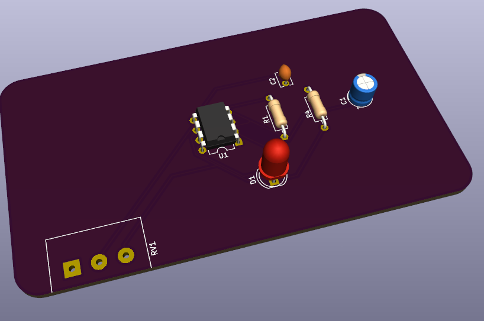

# sesion-10a

 .

 .
  .

 .
 
  .
  
   .
   
   .
   

encargo-10a
esquemáticos y PCB en KiCad
cada estudiante debe tomar 2 de las 4 secciones distintas del sintetizador realizado en el proyecto 1, y crear un proyecto en KiCad por cada una, que contenga tanto el esquemático y la PCB de cada sección.

anotar cada paso en la bitácora, incluyendo mayores aprendizajes y dificultades encontradas, además de problemas y dudas que quieran que abordemos en la próxima clase.

lectura de libro de Flusser, capítulo 1
leer introducción y capítulo 1 del libro Hacia una filosofía de la fotografía, de Vilém Flusser, disponible en https://monoskop.org/images/8/8d/Flusser_Vilem_Hacia_una_filosofia_de_la_fotografia.pdf
pensar criticamente la tecnologia y las imagenesquien los produce, como funcionan, que mensaje transmite, y como influten en nuestra manera de pensar 
fotografia como sistema politico y cultural
