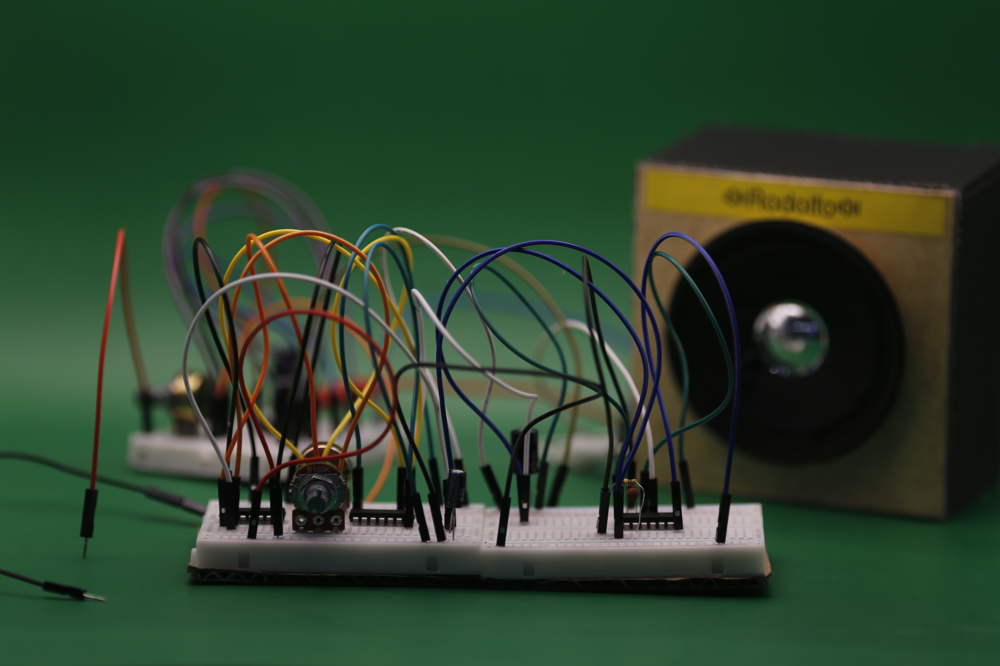
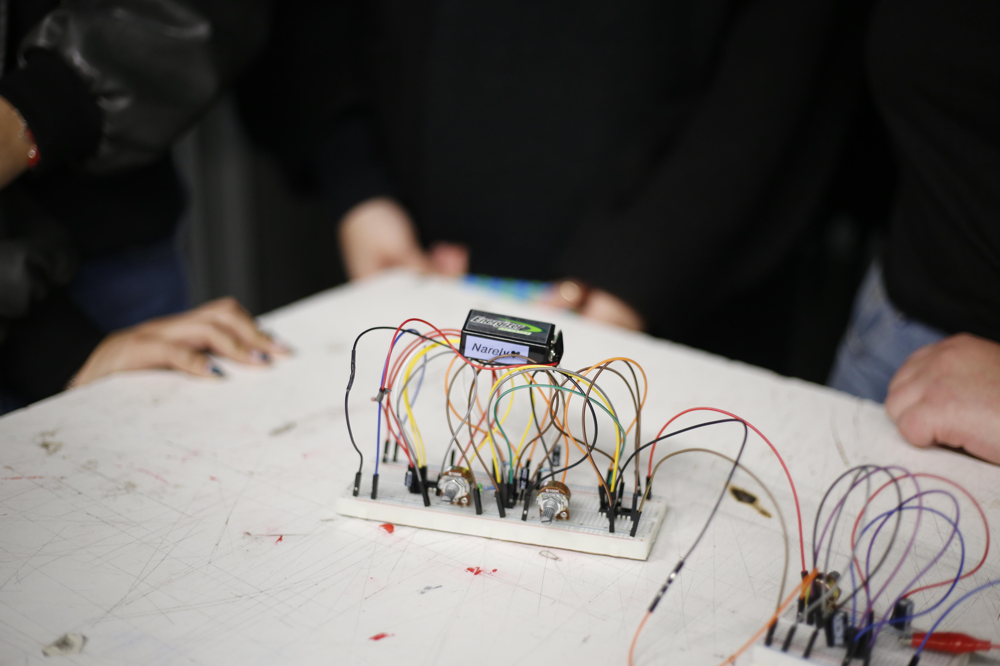

# sesion-12b

## Presentamos el proyecto 02 yeiii!!!

Las presentaciones estuvieron bacanes, como siempre. Fuimos los segundos en presentar nuestro proyecto. Explicamos toda la parte técnica y cómo desarrollamos nuestras dos propuestas de osciladores. Mostramos videitos del proceso y también lo hicimos funcionar en vivo.

**Fotitos que saco emi**

Proyecto 02 terminado... wow quien diría que LO LOGRAMOS!!!!
