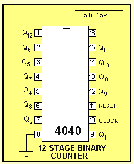

# sesion-10a

## For Want of (not) Measuring ##

En esta charla / presentación no logré conectar mucho, debido al cansancio físico que acarreo de estas últimas semanas, igualmente estas fueron unas ideas que logré anotar

- The futility of measuring - Patrick

Se basaba / fundamentaba en como hace 300 años atrás lograron calcular la masa de la tierra con tan solo 20% de margen de error

> <https://www.bbc.com/mundo/vert-tra-58930883>

Luego de perderme y marearme por el formato de la charla (inglés y español a ratos en simultáneo) hubo un segmento que llamó mi atención, ya que incluye técnlogías que no solo me fascinan por lo novedoso, si no que por la integración en futuros proyectos.

Este utilizaba un scanner de arquitectura / ingeneria civil con el cual mapeaba un arbol, esto se lograba mediante la recolección de 8 millones de puntos que medía el scanner (mediante un láser rotatorio en el eje X e Y). Acá lo llamativo es entender como se construye una fotografía tridimensional (modelo 3D) mediante la captura de 8 millones de momentos diferentes, esto si relacionamos cada punto como un instante en un espacio y momento específico

 

### Conclusión ###

A pesar de estar en espacios que no son de mi total ínteres, siempre se puede llevar un aprendizaje, un referente, una idea o cuestionamiento. En este caso además del scanner aprendí lo anterior mencionado, lo que es algo valioso, ya que constantemente no participo de diversos espacios si no existe algo que llame fuerte mi atención, esto me sirve como invitación futura (considerando las palabras que Aaron nos comenta múltiples veces) a tomarme los espacios a nutrirme de muchos lados 

😛

 

---

## Revisión ##

Como grupo coordinamos de que manera trabajar hasta la siguiente clase, además de consultar a Misa sobre algunas dudas que teniamos, quedando así el final de la sesión en clase

- En base a los IC revisados elegiremos inicialmente 3 o 4 para investigarlos con mayor profundidad

- La idea es llegar el día viernes con un esquemático por cada chip, para prototipar en la protoboard

- Consultamos a Misa por el chip _4022_ (contador bínario), nos mencionó que es posible realizar un secuenciador con el, pero que nos acomplejaría que el cambio de _step_ es en negativo (es decir al bajar la corriente), por lo que nos recomendó el 4040, el cual es más fácil de manipular porque cada cambio o activación de step sucede al recibir corriente

  > O eso entendí yo, profundizaré en la semana sobre esto

- Además se nos confirmo que como grupo solo cumplimos la misión de realizar este _divisor de corriente_ par que el VCO logre modificar sus sónidos, por lo mismo, decidimos buscar la manera de utilizar los transistores para incluir Leds a modo de experiencía de usuario

Adjunto 2 vídeos que me llamaron la atención:

- <https://www.youtube.com/watch?v=qTt-daIfq_Q>: Explica el funcionamiento del chip que nos comentó Misa y el como conectarlo

- <https://www.youtube.com/watch?v=ZSGaglkNxX8>: Este video lo encuentro la guinda del pastel, porque es un secuenciador mediante transistores. Acá nos desahacemos de las cajas negras y utilizando componentes "_básicos_" logramos un secuenciador

  > Mi grupo no está tan convencido de utilizar esta opción, pero investigaré en otro momento el como funciona, ya que quiero entender como la base de la electrónico funciona (espero que sea asi xd)
  

### Trabajo en casa ###

Tal como mencioné antes, Misa nos compartió un 4040, que es un contador binario para utilizar como secuenciador. Quise investigar más sobre el y encontré mucha similitud con el _CD4017_, por lo sencillo en sus conexiones

 

En base a la imagen y videos de youtube como el de más arriba llegue a este esquematico para probar en clases el viernes 

 

## Texto - cap 4 y 5 ##

En estos capítulos se enfoca en como la fotografía se relaciona con las personas, planteando 4 conceptos claves 

- Caja negra: Este concepto se nos ha mencionado recurrentemente en clases, cuando nos referimos a algo que no entendemos como funciona, a quien le damos el inpout para obtener una respuesta, tal como ocurre en una camara. Uno presiona el botón (input) ocurre la magía en la caja negra y se optiene una fotografía (output)

- Herramienta

- Aparato

- Máquina

La mención de estas ideas me parecen interesantes, ya que me genera genuina duda de como yo entiendo e interpreto los objetos que me rodean. Si tuviera que definir y categorizar los objetos ¿Como lo haría? Esta duda la podre desarrollar en algún momento, posiblemente cambie, todo en base a los conococimientos que vaya adquiriendo
