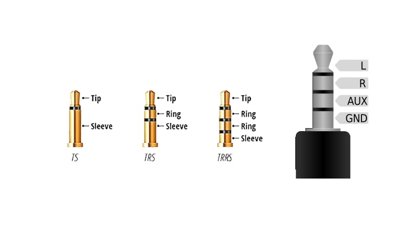
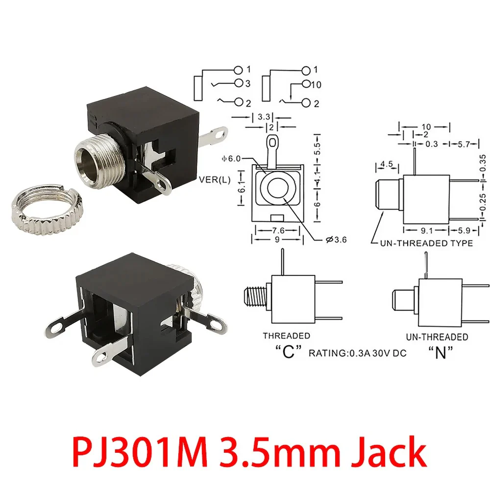
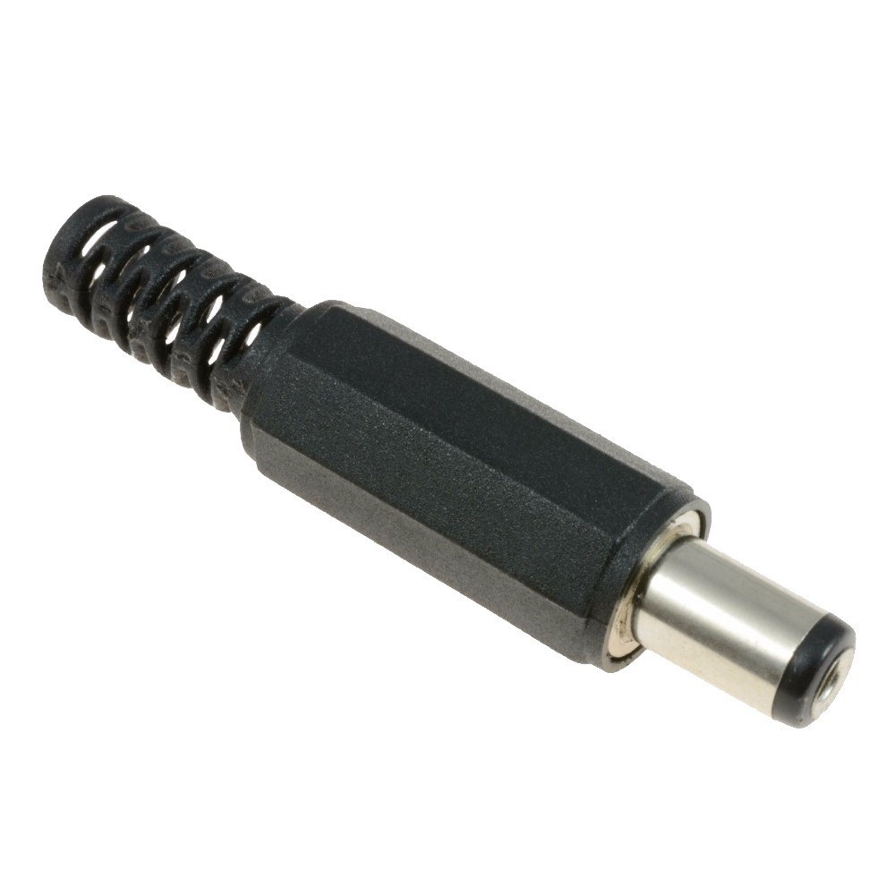

# sesion-11b

## Clase

### Conexiones

Algo importante que se debe considerar cuando un grupo humano trabaja en paralelo es estandarizar ciertos elementos, en este caso, las interconexiones. Estas ocurren cuando debamos conectar nuestro circuito al sistema curso que se va a generar

Existen ya ciertos estándares en la industria, siendo los dos principales:

- Moog

- EuroRack

Estos poseen ciertas especificaciones en tamaño y conexiones tanto internas como externas.

¿Por qué es importante?

Porque vamos a generar 64 posibles sintetizadores (espero que sea así, no recuerdo mucho estadística) y entendiendo todo esto, es fundamental que se puedan conectar bajo cierto estándar.

Como curso se estableció que se utilizará, para llevar la señal correspondiente al sonido, cables Jack 3.5 mm y, para el poder 💪, conectores Plug de 5.5 mm

 

#### Jack 3.5mm

 

Específicamente usaremos del tipo TS. Que viene de sus partes Tip, que es la punta, donde comunmente va la señal y Sleeve, que es literal su manga, que por lo general es Ground

Obviamente debemos conectar esto a una terminal, en este caso será un PJ301M, tambien de 3.5mm (creo recordar que el modelo es ese, si no es, se parece demasiado xd)

 

De este conector (que coloquialmente se le conoce como hembra) se debe resaltar que posee un tipo de switch, en la imagen no se aprecia bien, pero que la mayoría puede reconocer. Este consta de que al concectarse el Jack de 3.5mm, se escucha un pequeño click, esto nos indica que el interruptor se activó y manda una señal (por el pin que se encuentra en el medio) que normalmente silecia un parlante para que no haya 2 fuentes de sonido.

 

#### Plug 5.5mm

Clásico conector de corriente, importante entender que existen 2 posibilidades: centro positivo o centro negativo.

 

---

Se nos mencionó otra estandrización, que es la alimentación de cada circuito. Misa realizó un esquemático, el que debe unirse al nuestro.

El porque y como funciona se explicará en la próxima sesión, debido a que recien ahí implementamos y entendimos sus partes

---

## Desarrollo Proyecto

En esta sesión seguimos con un enfoque en el 4015, el cual dio bastantes problemas.

Estos se resumen en:

- Led quemados

- Resistencias conectadas en rieles equivocados

- Placas sin alimentación

- Cables donde no corresponden

En resumen, los clásicos de clásicos en los errores, por lo que no profundizaré tanto en ello

Aprovecho este espacio para escribir que me está dificultando el trábajo de esta manera, el grupo tiene porblemas de comunicación. Ya que nos cuesta decidir que hacer, recíen en esta clase definimos que Secuenciadores vamos a realizar como tal, además de que la toma de desiciones se siente más una desición unilatertal por la falta de opiniones, espero que esto mejore, pero es algo que me quita motivación para seguir trabajando. 

Por mi parte, en esta sesión me dedique a resolver dudas técnicas en mi grupo, en relación al funcionamiento de las conexiones con las partes mencionadas anteriormente.

Dentro de las dudas más importantes, fue la conexión de los pasos o step con los osciladores, pero se aclaró rapidamente que para eso estaban los conectores Jack, que ibamoas a tener un conector por cada salida.

Otro elemento que se realizó fue la definir lineas generales al momento de redactar en el informe grupal sobre el secuanciador

- Partir de una base coloquial, usar analogías

- Utilizar recursos visuales en la medida de lo posible

- A pesar de que por sesión una persona se encargara de escribir, todxs debían aportar igualmente

 

---

 

En lo personal siento que estamos logrando que funcione, no nos llevo muchas iteraciones encontrar las soluciones adecuadas. Pero si me llama la atención la dínamica del grupo, esto hace que nos dificulte avanzar de la manera correspondiente y nos atrasemos
