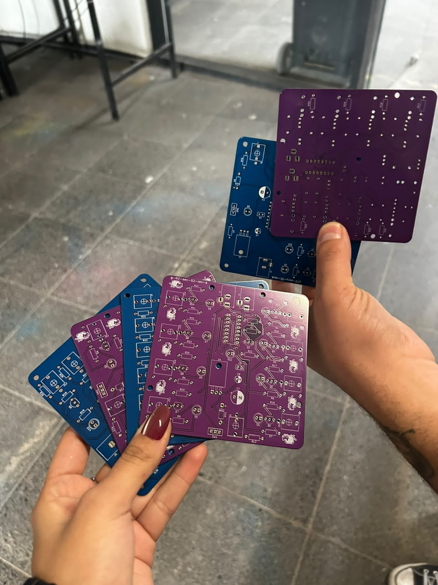
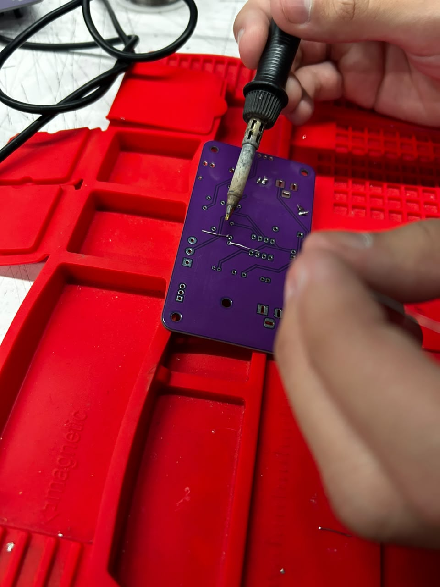

# sesion-13b

15-06-2026

## Proceso en clase

Llegaron las placas y procedimos a trabajar en ellas soldando componentes, porque nuestra idea es tener todas las placas funcionando y, a partir de esa gran cantidad de posibilidades, elegir cuál es la que mejor se acomoda a nuestro proyecto. Respecto a esta clase y la siguiente, estuvimos mucho en contacto con la materialidad y la realización de la presentación del proyecto. Esto incluye que parte del proceso haya sido (clavarme una astilla de metal) de los mismos materiales cortados que sobraban al haberlos soldado en la placa; fue entre medio del dedo y la uña, con 1 cm de profundidad aprox 💀. Luego tuvimos una experiencia un tanto extraña a la hora de comprar más componentes para terminar de soldar la cantidad tan grande de placas que tenemos, porque pusimos más de 63 resistencias solo de 1k, y ya se imaginarán con los otros componentes. De hecho, voy a traer la tabla donde se reúnen todos los materiales en una sola:

### BOM Simplificada

| Componente | Tipo / Valor | Cantidad Total |
| :--- | :--- | :---: |
| **Base Dip** | 8 pin | 2 |
| | 14 pin | 8 |
| | 16 pin | 5 |
| **C. polarizado** | 0.22µF | 1 |
| | 1µF | 5 |
| | 4µF | 1 |
| | 10µF | 20 |
| | 47µF | 1 |
| | 100µF | 15 |
| | 220µF | 1 |
| **Capacitor** | 4nF | 1 |
| | 10nF | 3 |
| | 33nF | 1 |
| | 100nF | 19 |
| | 150nF | 1 |
| | 330nF | 1 |
| | 1µF (No polarizado) | 3 |
| **Chip** | 555 | 2 |
| | 4015 | 1 |
| | 4017 | 1 |
| | 4040 | 1 |
| | 4046 | 2 |
| | 4069 | 1 |
| | 4070 | 1 |
| | 40106 | 5 |
| | L7805 | 9 |
| | LM324 | 1 |
| | TL072 | 1 |
| **Conector** | Barrel (Alimentación) | 20 |
| | Jack (Audio/CV) | 27 |
| **Diodo** | 1N4007 | 10 |
| | 1N4148 | 5 |
| | BAT85 | 2 |
| **LDR** | Fotoresistencia | 25 |
| **LED** | Indicador estándar | 29 |
| **Perno** | M3 | 36 |
| **Resistencia** | 47Ω | 1 |
| | 100Ω | 1 |
| | 220Ω | 9 |
| | 1KΩ | 63 |
| | 2KΩ | 2 |
| | 10KΩ | 5 |
| | 100KΩ | 9 |
| | 330KΩ | 1 |
| | 470KΩ | 2 |
| **Switch** | SPDT | 9 |
| **Transistor** | 2N2222 | 15 |

y también dejaré unos ejemplos que aparecen en el avance del proyecto para el examen:

---

## Pomelo Yoko Ono

Antes que nada, seré sincero: no había leído nada de un libro de taller hasta el momento por motivos personales, de tiempo y por pereza, así que asumo que no los leí debidamente, pero al menos no los resumí con IA ;D

Ahora sí, leí varias páginas de este libro y me recuerda personalmente al libro troll del Rubius, donde se plantean retos para hacerse, pero algunos resultan muy difíciles de cumplir, ya sea por la sociedad, cosas personales o simplemente porque no te gustaría hacerlo. En lo personal, siempre quise completar un libro así, pero este tiene un sentido que va más allá de lo posible de hacer por una sola persona en una sola vida, y porque la misma vida no te permite tener todas las posibilidades o todo lo que deseas. En ese sentido, se me hace muy extraño que esto sea una partitura, porque se vuelve una obra completamente inalcanzable. Aún así, decidimos colocar una partitura de este estilo en el proyecto, y nos fuimos más por el lado de conectar con uno mismo más que con el instrumento en sí, interactuando con él o sintiendo o viviendo alrededor de este mismo. Porque, de todas formas, lo que influye es tu interacción con el sonido, el instrumento y lo que se haga durante la instancia en la que se convive. Me parece bastante adecuado porque es lo que es vivir con lo natural y con la espontaneidad de las plantas y lo que es dejar ser, en caos o en equilibrio, pero que solamente sea.

Eso es lo que tengo que acotar sobre lo que leí y cómo lo asociamos y lo aterrizamos a un punto más rescatable para nuestro proyecto, de alguna forma.
