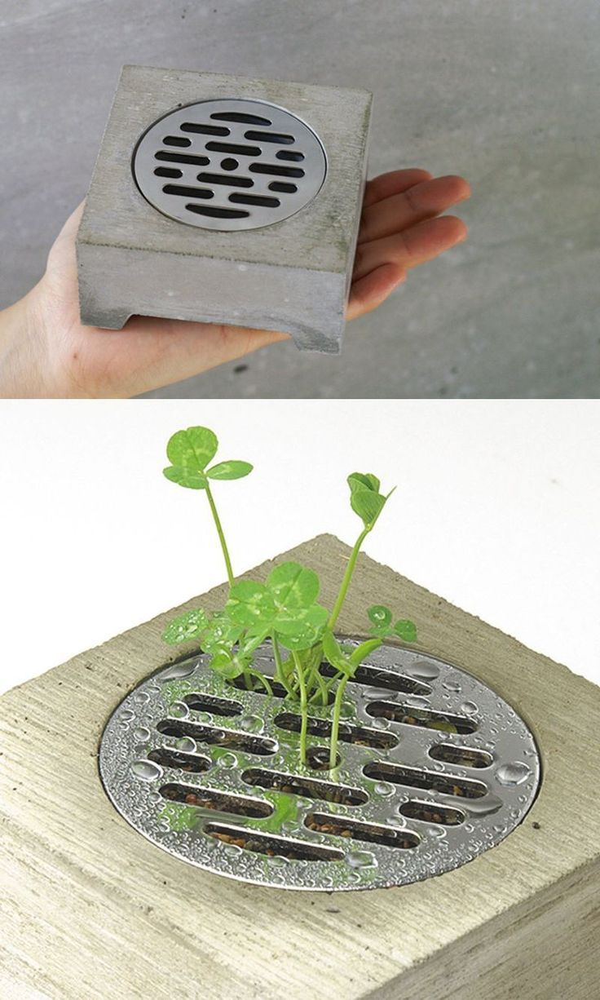

# sesion-14a

19-06-2026

## Revisión de proyecto con presentación

Nos evaluaron teniendo en consideración nuestro proceso y que la idea que tenemos de implementar una planta a nuestro proyecto debería tener más protagonismo, por lo que sintieron que faltó desarrollo en ese contexto. Sin embargo, sentimos que no se entendió de la mejor manera nuestra idea. Después de eso, estamos evaluando qué hacer con respecto a ese tema en el proyecto o si de plano lo descartamos para poder dar a entender nuestro proyecto como queremos, pero enfocado más en el contexto que buscamos.

 

En esto también nos dieron el visto bueno en que no solo elegimos el acrílico transparente por algo estético, sino que lo hicimos para darle luz a las plantas y hacer nuestro juego de luz y sombras, impulsado por los circuitos y teniendo protagonismo aquí los LDR, cambiados por los potenciómetros que estaban puestos anteriormente. Así dejamos este juego entre la persona y el sintetizador interactivo con luz y sombra. Lo dejamos en proceso de conversación, pero tenemos que seguir ajustando detalles.
