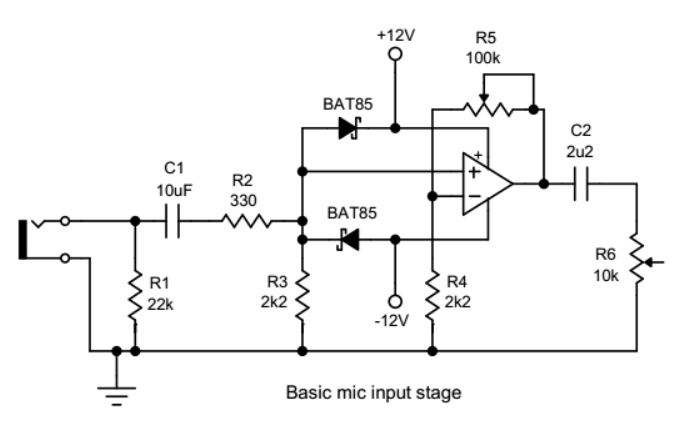
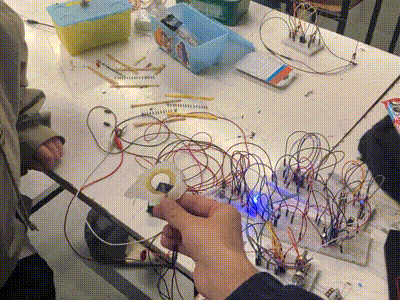

# sesion-12a

# Clase 02/06

Esta clase es la última antes de la entrega del proyecto 02!! por lo que estuvimos trabajando full en todo momento.

Anteriormente se había logrado aumentar la sensibilidad del piezo 01 mediante un amp, pero este era muy poco estable y había momentos en los que dejaba de funcionar debido a que se soltaban los componentes de la protoboard, razón por la que decidimos cambiar de proto, pero de igual manera no funcionó. Durante esta clase se volvió a armar el mismo amp que la vez anterior y ya no funciona, por lo que decidimos buscar otro circuito utilizando el chip tl072 y decidimos utilizar el siguiente esquemático que se rescató de este sitio: <https://www.diyaudio.com/community/threads/tl072-as-mike-input-preamp.317907/>:

"Problemas" que tuvimos al momento de armar el circuito:

+ Como en este esquemático no aparecen los pines con sus números, nos guiamos de otros esquemáticos del mismo chip para asumir los pines que se utilizaban.
+ No teníamos ni capacitores cerámicos ni resistencias del mismo valor que muestra el esquemático, por lo que se improvisó de manera absurda utilizando componentes de valores distintos (no necesariamente cercanos al que se muestra en el esquemático).
+ Aún no entendíamos cuál era la diferencia del símbolo GND y VBUS por lo que le preguntamos a Misa e incorporamos un VBUS en nuestro esquemático.

Cuando terminamos de armar el circuito (en realidad lo hizo Bruno XD), yo no tenía mucha esperanza de que fuese a funcionar, por lo que me encontraba un poco estresado. Cuando se encendió el circuito en la protoboard y se empezó a cambiar la resistencia del piezo mediante los potenciómetros, fue hermoso ya que funcionaba de manera estable y tú mismo podías decidir qué tan sensible tenía que ser el piezo!! luego cambiamos unas resistencias y un potenciómetro para hacerlo aún más sensible y se podía manejar el piezo solo utilizando la voz, lo cual fue hermoso. Adjunto GIF que hizo Bruno en donde se ve como le grito al piezo y este reacciona:

